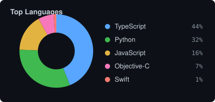

# Shreyansh Sharma

**Software Engineer**

Building LLMs and ML tools

[Portfolio](https://shreyanshsharma.dev) ·
[LinkedIn](https://linkedin.com/in/sharmasshrey) ·
[Email](mailto:inquiries@shreyanshsharma.dev) ·

 

**AI/ML Engineering Intern @ [Rezolve.ai](https://rezolve.ai)**

 

 

### Languages & Technologies

  

`Objective-C` · `SQL` · `Twilio` · `MLX` · `MoveNet` · `MCP` · `Gemini` · `Stripe` · `Zod` · `Vitest` · `pytest` · `Playwright`

### Featured Engineering

<table>
<tr>
<td width="50%" valign="top">

#### [Cyber Agent](https://github.com/shrey1110-dotcom/Cyber_agent)

A local cybersecurity model and terminal agent I trained from scratch on limited hardware. It can inspect files and run a fixed set of tools, but only inside a Docker container with no network.

Built the data pipeline, tokenizer, MLX training path, and the sandbox that keeps tool calls locked to a small JSON schema.

 

`Python` · `Docker` · `MLX` · `pytest`

[Repository →](https://github.com/shrey1110-dotcom/Cyber_agent)

</td>
<td width="50%" valign="top">

#### [ScopeKit](https://github.com/shrey1110-dotcom/ScopeKit)

A CLI that picks the files, symbols, and tests an AI coding agent actually needs for a task, instead of dumping the whole repo into context.

Works with Claude, Codex, and Cursor over MCP. Published on npm.

 

`TypeScript` · `Node.js` · `MCP` · `Zod` · `Vitest`

[Repository →](https://github.com/shrey1110-dotcom/ScopeKit) ·
[Live Site →](https://scopekit-sandy.vercel.app) ·
[npm →](https://www.npmjs.com/package/scopekit)

</td>
</tr>
<tr>
<td width="50%" valign="top">

#### [Motion Analysis](https://github.com/shrey1110-dotcom/Motion_analysis)

Takes live camera or uploaded workout video, tracks body pose in the browser with MoveNet, then scores form on a FastAPI backend.

The browser sends keypoints. The API computes joint angles, compares them to reference ranges, and returns a score plus coaching notes.

 

`Python` · `FastAPI` · `TensorFlow.js` · `MoveNet` · `Docker`

[Repository →](https://github.com/shrey1110-dotcom/Motion_analysis)

</td>
<td width="50%" valign="top">

#### [Frontline AI](https://retain-ai-eight.vercel.app)

Product for local service businesses that miss calls and texts. It answers SMS, can call people back, and hands messy cases to the owner.

Private Next.js app on Twilio webhooks, Supabase, and Gemini, with Stripe billing and Vitest coverage.

 

`Next.js` · `TypeScript` · `Twilio` · `Gemini` · `Supabase` · `Vitest`

[Live Product →](https://retain-ai-eight.vercel.app)

</td>
</tr>
</table>

### Engineering Activity

  

 

  
  

 

### Currently Building

- Secure local AI agents with sandboxed tool execution
- Context tooling for AI coding agents (ScopeKit)
- Voice / messaging AI product infrastructure (Frontline AI)
- Local model training and inference pipelines

---

If you like my work, follow.

[Portfolio](https://shreyanshsharma.dev) ·
[LinkedIn](https://linkedin.com/in/sharmasshrey) ·
[GitHub](https://github.com/shrey1110-dotcom) ·
[Email](mailto:inquiries@shreyanshsharma.dev)

